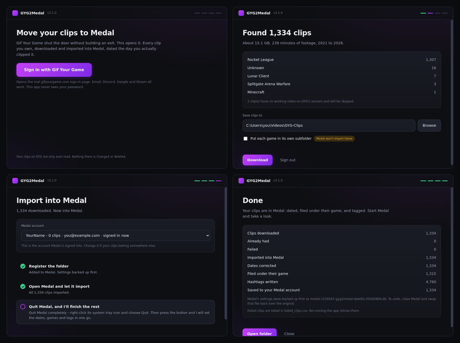

<div align="center">

# GYG2Medal

**Move your Gif Your Game clip library into Medal, dated the day you actually clipped it.**

[](https://github.com/AmarMassoud/gyg2medal/releases/latest)
[](LICENSE)



</div>

## Why this exists

Medal acquired Gif Your Game and never shipped a way to move your clips across.
The feature request sat on their feedback board and was archived without being
built. GYG's library is gone from the web, so most people assume their clips
went with it.

They didn't. GYG2Medal signs you in, pulls your library down, and hands it to
Medal with the right dates, the right games and your tags intact.

## Features

- **Complete library export.** Finds every clip on your account, including old
  ones that stopped appearing in GYG's own interface years ago.
- **Full quality.** Downloads at 720p60, and resumes where it left off if
  interrupted.
- **Correct dates.** Clips land in Medal dated when you captured them, not when
  Medal happened to notice the file.
- **Correct games.** Clips are filed under the game they were recorded in
  instead of everything landing in "Imported".
- **Tags carried across.** Your GYG tags become Medal hashtags.
- **Changes that last.** Games and tags are saved to your Medal account as well
  as locally, so they survive Medal's own sync instead of reverting to
  "Imported" a few hours later.
- **Read-only on GYG.** Nothing on your account is modified or deleted.

Sign-in runs on GYG's own login page, so email, Discord, Google and Steam all
work exactly as they do on the website.

## Installation

Download the installer from
[Releases](https://github.com/AmarMassoud/gyg2medal/releases/latest) and run it.
A portable `.exe` is available on the same page if you'd rather not install.

Windows only, since Medal's desktop app is Windows only.

The app isn't code signed, so Windows will show a blue **"Windows protected your
PC"** dialog. Click **More info → Run anyway**. A signing certificate runs a few
hundred a year and this is a free tool. If you'd rather not take my word for it,
the source is all here — [build it yourself](#building-from-source).

## Dates

You can already download clips by hand and drop them into a folder Medal
watches. The problem is what happens next.

Medal stamps every imported clip with the moment it scanned the file — not the
file's modified date, and not anything stored inside the file. Import two
identical clips, one timestamped 2021 and one from that morning, and both land
in Medal as today.

The result is that years of clips arrive as a single enormous day, in arbitrary
order, with no way to tell a 2021 highlight from last week's.

GYG2Medal restores the real capture dates once the import has finished. A test
library went from one undifferentiated block to:

```
2021: 557    2022: 434    2023: 244    2024: 91    2025: 7    2026: 1
```

No manual workaround gets this right, which is the main reason the tool exists.

## Games and tags

Medal files everything it imports under a single category called **Imported**.
GYG2Medal re-files each clip under the game it was actually recorded in, using
the game list already present in your Medal install. Anything it can't match
confidently is left as Imported rather than guessed at. Lunar Client and similar
are mapped to their parent game.

GYG tagged clips automatically as you played, and those carry across as Medal
hashtags:

```
#goal #save #assist             what kind of clip it is
#2v2 #ranked #casual #hoops      playlist
#mannfield #dfh-stadium ...      31 arenas
#champion2 #diamond1 ...         the rank you were at the time
```

A 1,334 clip library produced roughly 4,760 hashtags. The year, month, week and
day auto-tags are dropped — Medal already groups by month, and they'd add four
redundant hashtags to every clip.

## Making it stick

Setting the game and tags in Medal's local database is not enough on its own,
and this took a while to work out.

Medal uploads every imported clip to its own servers as a private draft. Each
clip gets a `remote_content_id` and a copy of its metadata in Medal's cloud, and
from that point the server is the authority. When a clip is shown in your
library and its last sync is more than four hours old, the desktop app refetches
it and writes the server's version back over the local row.

So a local-only change looks perfect, survives closing Medal, and then quietly
disappears. Come back later and every clip is sitting in "Imported" again with
no hashtags. Capture dates are the exception, and only by luck: Medal never
sends `created_at` to the server, so there is nothing up there to overwrite them
with.

GYG2Medal therefore finishes by making the same change Medal's own interface
makes, posting the game and tags to `/content/<contentId>` for each clip using
the credentials Medal already stored for the account you are signed into. A
1,334 clip library takes about twenty seconds. After that the local copy and the
server agree, and a sync confirms your clips instead of undoing them.

If Medal is signed out, or signed into a different account than the library you
picked, the app says so and stops rather than sending one account's clips with
another account's key.

## Medal behaviour worth knowing

**Medal only scans the top level of a watched folder.** Clips in per-game
subfolders are silently ignored — no error, no warning, just an empty library.
GYG2Medal defaults to a flat folder for this reason. The subfolder option is
still available, labelled with what it costs you.

**Medal only notices files that arrive.** It watches a folder for new files and
never enumerates what's already there. Point it at a folder that already
contains 1,334 clips and it will ignore all of them indefinitely. GYG2Medal
therefore registers the folder with Medal before downloading starts, and can
feed in already-downloaded files a batch at a time.

## Safety

Changes on the Medal side are made with Medal closed, and the app backs up your
Medal library before each step. Each step is verified after it runs; if the
result doesn't check out, the backup is restored automatically.

Folders you added yourself are always preserved, and every step is idempotent —
running it again changes nothing. Backups are named after the step they preceded
(`...gyg2medal-datefix-...`, `-games-`, `-tags-`). To restore one manually, close
Medal and put it back in place of `medal-<userId>.db`.

## Building from source

```bash
git clone https://github.com/AmarMassoud/gyg2medal
cd gyg2medal
npm run setup      # not npm install — see DEV.md
npm start          # run it
npm test           # test suite
npm run build      # produces dist/GYG2Medal-Setup-<version>.exe
```

Requires Node 18 or newer. No compiler needed — `npm run setup` fetches a
prebuilt native module for Electron's ABI. [DEV.md](DEV.md) covers the dev mode
that lets you work on the Medal steps without re-downloading anything.

Pushing a `v*` tag builds the installer on GitHub's Windows runners and attaches
it to the release. See [.github/workflows/build.yml](.github/workflows/build.yml).

## Contributing

Issues and pull requests are welcome. [CONTRIBUTING.md](CONTRIBUTING.md) covers
the layout of the code and what to watch out for.

If something goes wrong, the Medal screen has a **Copy diagnostics** button —
pasting that into an issue saves a lot of back and forth.

## Disclaimer

Unofficial, and not affiliated with Medal or Gif Your Game. It reads your own
account at a modest request rate and writes nothing back to it. Use it to get
your own clips back.

## License

MIT — see [LICENSE](LICENSE).
